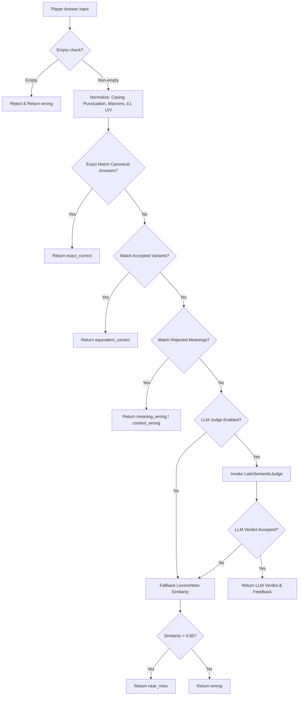

# Dialogue-First RPG Mechanics & Semantic Latin Evaluation

This document outlines the mechanics and architecture introduced in **Stage 16**, moving away from "form-filling" grammatical tasks to dynamic dialogue interactions with NPCs, with semantic, contextual, and pedagogical assessments.

---

## 1. Concept: Dialogue-First Interactions

Instead of presenting players with a dry "write the correct Latin translation" challenge, Stage 16 introduces immersive NPC dialogues where players respond in character:
- **Dialogue Response Mode (`dialogue-response`)**: The player is presented with the NPC's prompt in Latin and Turkish, a specific communicative goal (intent), and a text box to write their response in Latin.
- **Hybrid Dialogue Mode (`hybrid-dialogue`)**: The player is presented with multiple conversation intents (e.g. "Introduce yourself as Marcus" vs. "Politely ask to enter"). Selecting an intent locks the intent card, displaying the target meaning and expecting the matching Latin text response.

---

## 2. Semantic Evaluation Pipeline

Dialogue responses are processed by `SemanticLatinEvaluator` on the backend, which implements a multi-step semantic matching pipeline:

### Normalization Logic
Our `LatinNormalizer` guarantees robust equivalence checking:
1. **Case-Insensitive**: All inputs are normalized to lowercase.
2. **Macron Stripping**: `ā`, `ē`, `ī`, `ō`, `ū`, `ȳ` map to standard vowels.
3. **Punctuation Ignoring**: Trailing exclamation marks, commas, and question marks are stripped.
4. **Consonantal IU & VU Toleration**: Support for J/j -> I/i and V/v -> U/u normalization to accommodate spelling variations.

### LLM Judge (`LatinSemanticJudge`)
When exact or variant matching fails, the LLM Judge validates the semantic correctness:
- Enforces strict parsing of spelling, grammar, and context.
- Returns Turkish pedagogical feedback, error tags, and grammatical notes.
- Restricts LLM responsibility to **evaluation only**; the LLM cannot decide XP rewards or trigger scene transitions.

---

## 3. Game Engine Integration

Dialogue challenges are processed deterministically inside `SceneSystem`:
- **Progress Tracking**: Dialogue attempts are stored in `save.flags` using keys like `dialogue_attempts_${sceneId}`.
- **Retry Mechanics**: If the verdict is incorrect, the engine checks `retryAllowed` and whether attempts are under `maxAttempts`. If so, the player stays on the same scene with a retry prompt.
- **Failures & Successes**: If the player succeeds, `successEffects` are executed and the next scene transitions. If they exhaust attempts, `failureEffects` are applied, transferring them to the failure scene.
- **Dialogue Log**: Successful turns are logged in `dialogueLog` as NPC/player conversation entries.

---

## 4. Frontend UI Components

We created a custom UI subsystem under `client/src/components/game/dialogue/`:
1. **`DialogueStage.tsx`**: The orchestrator of dialogue interaction. Renders bubbles, intent prompts, input composers, and semantic cards.
2. **`NpcSpeechBubble.tsx`**: Classic bubble containing the NPC's prompt in Latin, featuring a click-to-view translation drawer.
3. **`DialogueIntentCard.tsx`**: Tells the player exactly what their objective is (e.g. "Kendini Marcus olarak tanıt").
4. **`DialogueResponseComposer.tsx`**: Rich textbox for typing the Latin answer, with helper button for requesting hints.
5. **`SemanticFeedbackCard.tsx`**: Displays the evaluation results (e.g. *Recte* / *Paene recte* / *Non ita*) with custom color accents, error lists, grammatical notes, and retry/continue buttons.

---

## 5. Content Validation Checks

To maintain campaign integrity, `ContentValidator` and `AuthoringValidationService` now check:
- Valid `successNextSceneId` and `failureNextSceneId` target nodes.
- Speaker NPC existence checks.
- Overlaps between canonical answers, accepted variants, and rejected meanings to prevent logical conflicts.
- Presence of required fields (`playerIntentTr`, `targetMeaningTr`, `canonicalAnswers`).

---

## 6. Migration Utility

A migration utility (`scripts/suggest-dialogue-migration.ts`) was created to scan standard text challenges and generate suggestions at `docs/reports/dialogue-migration-suggestions.md` to transform them into immersive dialogue-first scenes.

## 7. Stage 16 Completion Notes

The playable modular Via Prima campaign now uses dialogue-first mechanics for its former text challenges: 116 text/hybrid language scenes were converted to `dialogue-response` scenes in `data/campaigns/via-prima/chapters/*.json`. Existing deterministic success/failure effects, retry loops, learning focus, rewards, and scene transitions were preserved on `dialogueChallenge`.

Additional completion fixes:

- `hybrid-dialogue` selected intent state is stored in `narrativeFlags`, so the frontend and RuleEngine read the same state.
- Successful dialogue transitions emit enough evaluation payload for post-transition feedback cards.
- The evaluator now includes deterministic morphology/person heuristics for omitted subject pronouns, word-order variants, grammar person mismatch, and context person mismatch before falling back to LLM/similarity.
- Authoring Studio exposes rejected meanings, grammar/vocabulary focus, context flags, equivalent/context reactions, canonical analysis, and dialogue preview controls.
